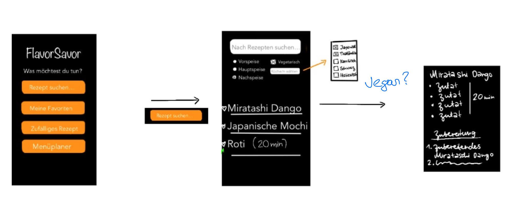
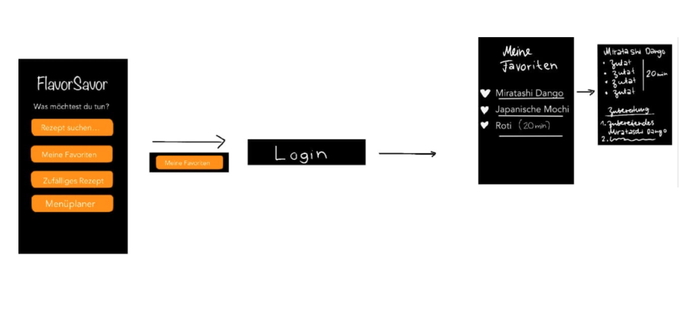
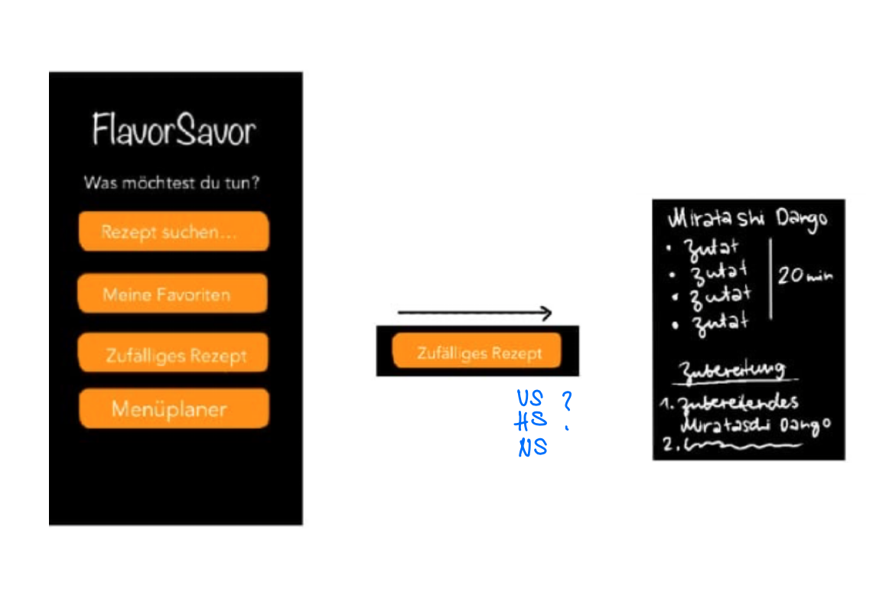
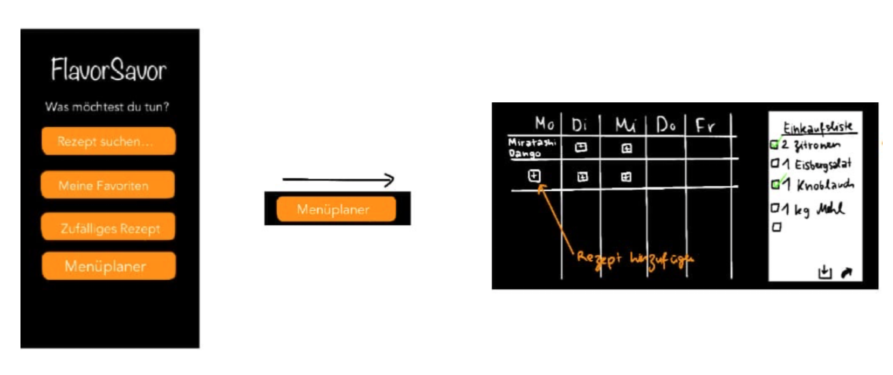

# Nutzertest    
Hypothese:   
Die App ist selbst erklärend und verständlich.

  
Der Nutzertest wurde mittels Bilder über das Ipad gemacht und anschliessen die Bemerkungen vermerkt.

  
 

Die Frage kamm auf ob Vegane auch als Kategorie angegeben werden soll?

  

Es gab keine Anmerkugen

     

Beim Zufälligen Rezept war die Frage, ob es Möglich ist diese diese Nach den Kategorien: Vorspeise, Hauptspeise und Nachspeiche, wählen zulassen.

  
    

Es gab keine Anmerkugen   

  
# Fazit     

Was war gut?    
Die Idee der App und er Aufbau der App ist gut. 

Was war schnelcht?   
Es war nichts schlecht die zwei Anmerkungen werden beachtet.

Neue Idee?   
Die Anpassugen in Vegan als Kategorie und beim Zufälligen Rezept die Möglichkeit der VS, HS und NS.

Neue Problem?   
Nicht wirklich, die iplmetation ist ein weiter Code beim Zufälligen Rezept. 

  
Die Hypothese wurde zum Teil bestätigt.
  
Der Nutzertest war daher erfolgreich und die zwei Punkte werden anschliessend im Kollegium besprochen.
