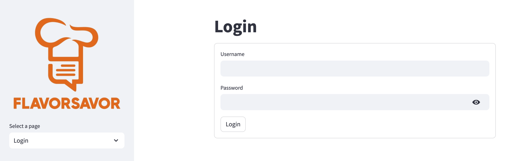
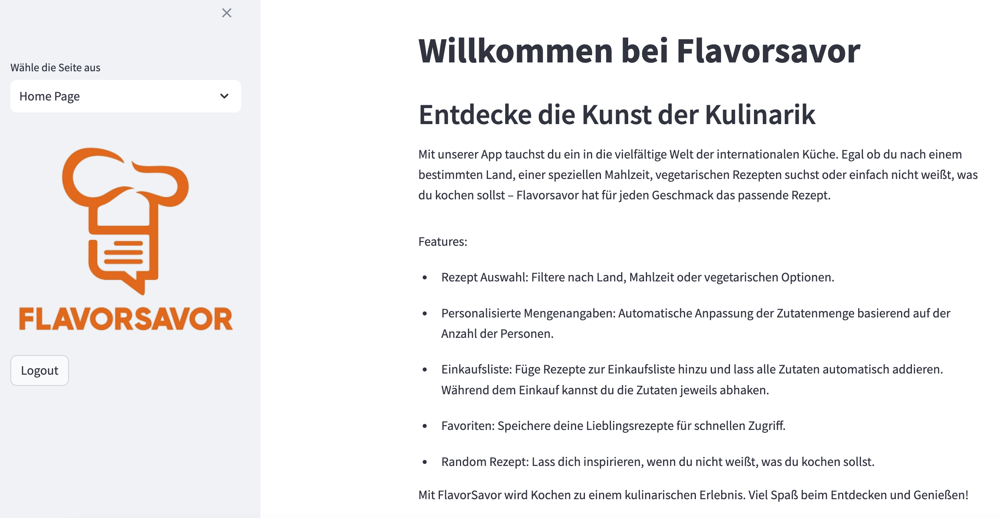
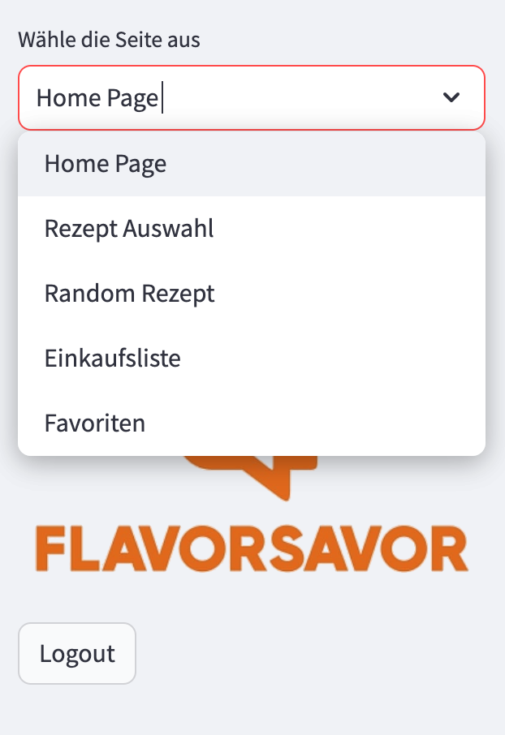
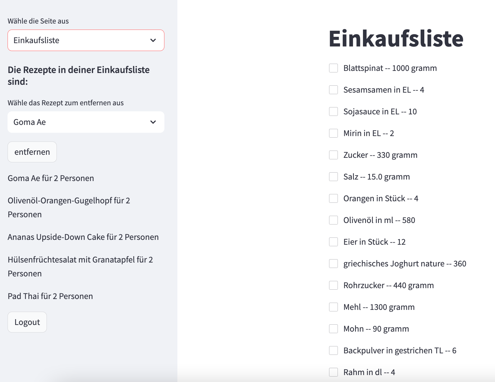
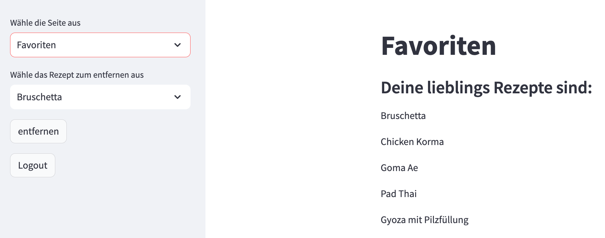

# Nutzertest nach Fertigstellung     
Hypothese:   
Die App ist selbst erklärend und verständlich.

  
Der Nutzertest wurde mittels des Link der App an drei Personen versendet diese haben unabhängig voneinander anschliessen je ein Feedback gegeben.

  
 

Das Login oder auch die Registriung ist direkt sichbar.

  

Die Hompage begrüsst eine mit den wichtigsten Informationen sowie eine kurze erläuterung der App.

     

Bei der Side bar gibt eine gute Übersicht der App und zwischen welchen Seiten man hin und her switchen kann.

  
    

Es gibt eine Vielzahl an Rezepten die Ausgewählt werden können. Diese werden nach Herkunft unterschieden sowie nach Vorspeise, Hauptspeise und Nachspeise.

  
    

Wenn man auf den Button "Random Rezept" klickt kommt einfach ein Zufälliges Rezept.  

  
    

Die Einkaufsliste listes alles auf was eingekauft werden muss und die gleichen Zutaten werden auch zusammen gezählt. 

  
    

Um seine Favoriten besser zu sehen gibt es auch die Auswahl Favoriten.  

  
# Fazit     

Was war gut?    
Die Idee der App und er Aufbau der App ist gut. 

Was war schnelcht?   
Es war nichts schlecht die zwei Anmerkungen werden beachtet.

Neue Idee?   
Die Anpassugen in Vegan als Kategorie und beim Zufälligen Rezept die Möglichkeit der VS, HS und NS.

Neue Problem?   
Nicht wirklich, die iplmetation ist ein weiter Code beim Zufälligen Rezept. 

  
Die Hypothese wurde zum Teil bestätigt.
  
Der Nutzertest war daher erfolgreich und die zwei Punkte werden anschliessend im Kollegium besprochen.