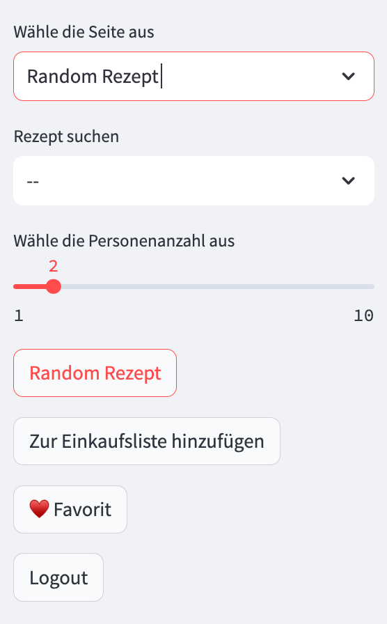
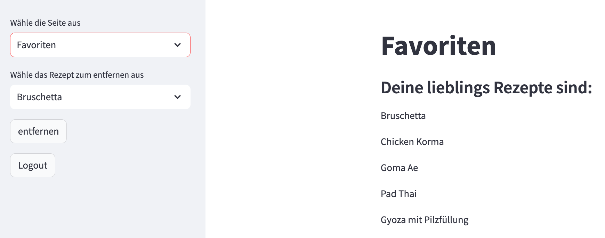

# Nutzertest nach Fertigstellung     
 
Hypothese: Die App ist selbst erklärend und verständlich.
 
 
Der Nutzertest wurde mittels des Link der App erstellet. Dieser Link wurde an drei Personen versendet, diese haben unabhängig voneinander anschliessen je ein Feedback gegeben.
 

#### Login
Das Login oder auch die Registriung ist direkt sichbar. 
 
 

#### Home Page
Die Home Page begrüsst eine mit den wichtigsten Informationen sowie eine kurze Erläuterung der App. 

 

#### Side bar
Bei der Side bar gibt eine gute Übersicht der App und zwischen welchen Seiten man hin und her switchen kann.  

 

#### Rezept Auswahl
Es gibt eine Vielzahl an Rezepten die Ausgewählt werden können. Diese werden nach Herkunft unterschieden sowie auch nach Vorspeise, Hauptspeise und Nachspeise. 
    
 

#### Random Rezept
Wenn man auf den Button "Random Rezept" klickt kommt einfach ein Zufälliges Rezept. 
    
 

#### Einkaufsliste
Bei der Einkaufsliste erscheint alles was man durch den Button "Zur Einkaufsliste hinzufügen" hinzugefügt hat.  Die Zutanen werden zusammengezählt für alle Rezepte die man gewählt hat. 
 
    
 

#### Favoriten
Um seine favorisierten Rezepte besser zu sehen gibt es auch die Auswahl Favoriten.  
 
    
 

## Auswertung:     
Zu den Personen die den Nutzertest gemacht haben. 
Person 1: Infromatiker 
Person 2: Angestellte im HR 
Person 3: Sozialarbeitering 
 
Was war gut? 
Person 1: Die Idee der App und er Aufbau der App ist gut. Das Coding ist intressant 
Person 2: Die App ist gut Stuktuiert und einfach in der Handhabung. 
Person 3: Die App hat eine gute Übersicht und ist gut Aufgebaut. 
 
Was war schnelcht? 
Person 1: Keine bemerkung für was schlechtes. 
Person 2: Keine Zeitangaben für die Zubereitung, sowie ob absichtlich die kcal nicht angeben worden sind zu den Gerichten. 
Person 3: Keine Kritik geäussert. 

## Fazit:

Die Hypothese wurde bestätigt bestätigt.
 
Der Nutzertest war erfolgreich und die App würden von allen Testnutzer als Intressant und Nutzenzwerde bezeichnet.